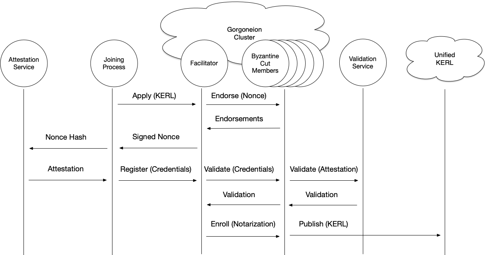

# Gorgoneion - Γοργόνειον
Apollo identity bootstrapping and secrets service

## Decentralized Identity Bootstrapping
Gorgoneion is primarily concerned with the bootstrapping of process identity.  Identity in Apollo is Identifier based and rooted off of the Key Event Receipt Infrastructure (KERI) architecture of the [Stereotomy](../stereotomy/README.md) module.

Gorgoneion is designed to be general enough to integrate with any fundamental identity attestation service that one might make use of in production settings.  Thus, Gorgoneion provides a federation framework for bootstrapping identity and trust across multiple infrastructure implementations, across regions and ultimately across disparate trust boundaries (due to the use of KERI decentralized identity at the foundation of the service).

The service ultimately provides the mechanism for introducing self sovereign (self managed) identity into a trusted realm so that these processes can interact in a secure fashion and be assured that the controller of an identifier (ultimately, ownership of a private key) is who they claim they are.

## Attestation Protocol

Gorgoneion is the implementation of a protocol that transforms trusted attestation into trusted identifiers.  The diagram below illustrates the protocol interaction

### Protocol Sequence

1. Joining process sends its KERL over as the application to any member in the Gorgoneion cluster
2. Facilitating member generates a Nonce and then calculates the byzantine cut of the cluster membership
3. Byzantine cut members sign the generated Nonce and the facilitating member gathers these signatures and returns the Signed Nonce to the joining member
4. The Joining member then calls the attestation service using the returned Nonce - either hashed, or whatever form the attestation service requires
5. A signed attestation is generated using the supplied Nonce information and returned to the joining member
6. The joining member generates the Signed Attestation from the attestation service's fundamental attestation, combines this with the signed nonce to create the Credential for enrollment
7. The joining member then sends the Credential to any member in the Gorgoneion cluster
8. This facilitating member then passes the Credential to the validating members (the original byzantine cut) for validation of the included attestation
9. Validating members of the byzantine cut call the attestation validation service (which may be local functionality, rather than a seperate service).
10. When validated, the members return the KERI validation for the joining member's KERL
11. The facilitation member then returns the gathered validations to the joining member
12. The joining member creates the Notarization - the combination of the joining member's KERL and Validations - and sends this to a member of the cluster
13. The facilitating member validates the Notarization and if valid then publishes the joining member's KERL and associated Validations to the destination Unified KERL

# Certificate Authority Functionality
Note that the Gorgoneion protocol serves the same function as a centralized Certification Authority (CA).  At the end of the protocol, the joining member's KERL serves as the equivalent of a certificate from that member that is now "signed" by the CA.  The difference is that the KERL is far more flexible and powerful than a simple Certificate and can evolve, rotate and interact in all the forms that KERI facilitates.  This evolving KERL is accepted into the group as validated through the Byzantine subset of the Gorgoneion cluster's membership as well as validated via an integrated attestation service such as AWS, GCP, Azure or even private clouds or SGX/TPM mechanisms.
